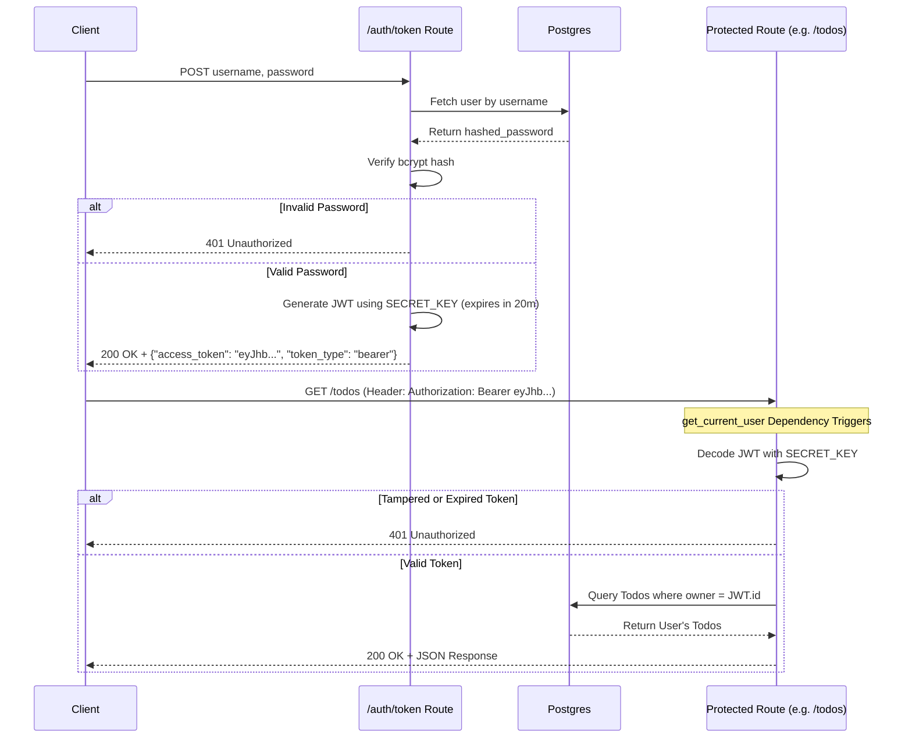

# Authentication and Authorization (`auth.py`)

Security in this FastAPI application relies entirely on stateless JSON Web Tokens (JWT) combined with the OAuth2 Password Bearer flow. This means the server does not keep a record of who is logged in; instead, the client holds a cryptographically signed "badge" (the JWT) that proves their identity.

---

## 1. Password Security (Hashing)
Never store plain-text passwords in a database. If the database is compromised, all user accounts are immediately vulnerable. 

```python
from passlib.context import CryptContext
bcrypt_context = CryptContext(schemes=['bcrypt'], deprecated='auto')

# During User Creation:
hashed_password = bcrypt_context.hash(create_user_request.password)

# During Login:
bcrypt_context.verify(password, user.hashed_password)
```
- **Hashing:** We use `bcrypt`, an algorithm specifically designed to be slow and computationally expensive. This prevents attackers from "brute-forcing" stolen password hashes quickly.
- **Verification:** When a user logs in, we don't decrypt the database hash (hashes are one-way). Instead, we hash the new incoming password and compare the two resulting hashes to see if they match.

---

## 2. Generating the JWT Token
When a user provides a valid username and password to the `/auth/token` endpoint, the server generates a JWT.

```python
def create_access_token(username: str, userid: int, role: str, expires_delta: timedelta):
    encode = {
        'sub': username,
        'id': userid,
        'role': role
    }
    expires = datetime.now(timezone.utc) + expires_delta
    encode.update({'exp': expires})
    return jwt.encode(encode, SECRET_KEY, algorithm=ALGORITHM)
```
- **The Payload (`encode`):** We embed non-sensitive identifying data into the token. Here, we pack the user's `username`, database `id`, and their `role` (crucial for RBAC). We also attach an expiration timestamp `exp`.
- **The Signature:** We use `jwt.encode` alongside a vast, unguessable string called a `SECRET_KEY` and an algorithm (like HS256). This cryptographically signs the payload. 

**Important:** The client can easily decode and read the contents of the payload. However, the client *cannot alter* the payload (e.g., changing their `role` to 'admin') because doing so without the server's `SECRET_KEY` would instantly invalidate the cryptographic signature.

---

## 3. The OAuth2 Bearer Flow (Authorization)
Once the client receives the JWT, they must attach it to the `Authorization` HTTP header of every subsequent request, formatted as `Bearer <token>`.

```python
oauth2_bearer = OAuth2PasswordBearer(tokenUrl='auth/token')

async def get_current_user(token: Annotated[str, Depends(oauth2_bearer)]):
    try:
        payload = jwt.decode(token, SECRET_KEY, algorithms=[ALGORITHM])
        # ... logic to return the user dictionary
```
- **`OAuth2PasswordBearer`:** This tool tells FastAPI where clients should send their credentials to get a token (`auth/token`). Crucially, when used as a dependency (`Depends()`), it automatically searches the incoming HTTP headers for the `Authorization: Bearer ...` string and extracts the raw token.
- **Decoding:** We then attempt to `jwt.decode` the token using the *same* `SECRET_KEY`. If the signature is invalid (meaning the token was tampered with) or the token has expired, PyJWT throws an error, and the server rejects the request with a `401 Unauthorized` status.

---

## Authentication Flowchart


