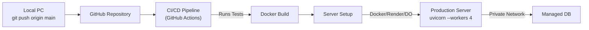

# General Deployment Options for FastAPI

Once your FastAPI backend is complete, tested, and running locally, you must "deploy" it to a server so external clients (React apps, mobile apps, or other APIs) can consume your data. 

FastAPI runs via the ASGI server `uvicorn`. Deployment essentially means installing Python, putting your code on a server, installing dependencies (`uv sync`), and running `uvicorn main:app --host 0.0.0.0 --port 80`. 

Here are the most common platforms for doing this.

---

## 1. Free / Hobby Tier Options

These options are perfect for personal projects, portfolios, or initial prototyping. They usually fall asleep when not in use ("cold starts"), but they cost \$0.

### Render
- **How it works:** You connect your GitHub repo to Render. You tell Render to run a simple Start Command (e.g., `uvicorn main:app --host 0.0.0.0 --port 10000`). Whenever you push code to `main`, Render automatically builds and deploys it.
- **Pros:** Incredibly easy UI; Free PostgreSQL databases (that delete after 90 days); native Python environment support.
- **Cons:** The free tier spins down after 15 minutes of inactivity. When someone pings it 2 hours later, they will wait 30-60 seconds for the server to wake up ("cold start").

### Railway / Fly.io
- **How it works:** Similar to Render but highly focused on **Docker**. You write a `Dockerfile` that packages your FastAPI app into a container. 
- **Pros:** Excellent developer experience, extremely fast builds. Fly.io deploys your code "at the edge" (closer to users physically).
- **Cons:** Railway recently removed their entirely free tier (now costs about \$1-\$5/month). Fly.io requires a credit card to prevent abuse, though small instances remain free.

### Vercel (Serverless Functions)
- **How it works:** Vercel is famous for Next.js and frontend hosting, but it natively supports deploying FastAPI backends as "Serverless Functions". You add a `vercel.json` file to your root directory telling Vercel to route all traffic to `main:app`.
- **Pros:** Extremely generous free tier with zero cold-starts. Seamless integration if your frontend is also deployed on Vercel. Global CDN delivery out-of-the-box.
- **Cons:** Vercel serverless functions have a strict 10-second timeout limit on the free tier. If your FastAPI endpoint does heavy database queries or AI processing that takes 12 seconds, Vercel will aggressively kill the request and return a 504 error.

### Deta Space
- **How it works:** Deta specializes in deploying Python/Node apps specifically.
- **Pros:** Genuinely free forever tier. Includes its own built-in NoSQL database (`Deta Base`) which can be easier than hosting Postgres.
- **Cons:** You cannot easily use standard PostgreSQL here; you are locked into their specific ecosystem.

---

## 2. Paid / Enterprise Options

For "serious work" (production apps, startups, high traffic), you need guarantees on uptime, dedicated RAM, and horizontal scaling capabilities.

### Amazon Web Services (AWS) - Elastic Beanstalk / ECS
- **How it works:** AWS is the industry standard. For FastAPI, you typically wrap the app in a **Docker container** and deploy it to Elastic Container Service (ECS) using Fargate. For simpler non-docker apps, Elastic Beanstalk automatically provisions EC2 servers and load balancers.
- **Pros:** Infinite scalability. You can connect your FastAPI app privately to massive AWS RDS Postgres databases over their internal VPC networks (highly secure).
- **Cons:** The learning curve is brutal. A simple mistake in configuration can cost hundreds of dollars.

### DigitalOcean (App Platform / Droplets)
- **How it works (Droplet):** You rent a raw Linux Virtual Machine (a "Droplet" for ~\$5/mo). You SSH into it, install Python, clone your Git repo, set up Nginx as a reverse proxy, and configure `systemd` to keep `uvicorn` running in the background.
- **How it works (App Platform):** DO's version of Render/Heroku. You connect GitHub, and it deploys automatically for ~\$5-12/mo.
- **Pros:** Predictable pricing (unlike AWS). Very developer-friendly documentation. Great balance between power and ease-of-use.
- **Cons:** You have to manage server security patches yourself if using Droplets.

### Google Cloud Run (GCP)
- **How it works:** You build a Docker image of your FastAPI application and push it to Google Cloud. Cloud Run takes your container and runs it.
- **Pros:** "Serverless Containers." You only pay for the *exact milliseconds* your FastAPI endpoint is processing a request. If traffic spikes to 10,000 users in a minute, GCP automatically spins up 50 containers, then scales back down to 0 when traffic stops.
- **Cons:** Docker knowledge is strictly required.

---

## Recommended Deployment Flow for FastAPI



### Key Production Consideration: Uvicorn Workers
When deploying for serious work, you never run a single `uvicorn` process. Node.js is naturally concurrent, but Python is restricted by the GIL. To serve hundreds of users simultaneously, you use multiple workers:
```bash
uvicorn main:app --host 0.0.0.0 --port 80 --workers 4
```
This boots up four identical copies of your FastAPI app on the server to handle immense parallel traffic perfectly.
