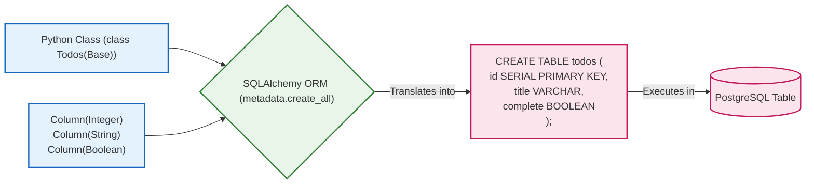
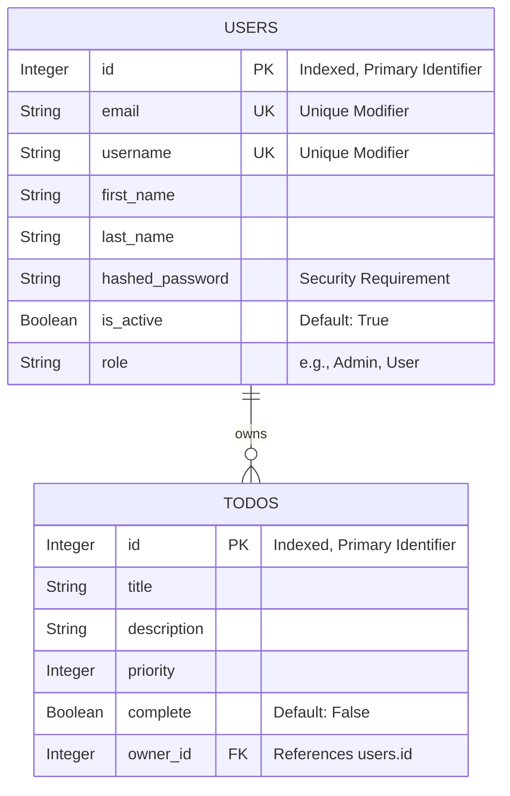

# Data Modeling Explained (`models.py`)

In FastAPI applications that use relational databases, we don't usually write raw SQL `CREATE TABLE` statements. Instead, we use an **Object-Relational Mapper (ORM)** like SQLAlchemy to define our database tables using Python classes. 

This process is called "Data Modeling," and in this project, it happens entirely within `models.py`.

Here is the code defined in `models.py`:

```python
from database import Base
from sqlalchemy import Column, Integer, String, Boolean, ForeignKey


class Users(Base):
    __tablename__ = "users"

    id = Column(Integer, primary_key=True, index=True)
    email = Column(String, unique=True)
    username = Column(String, unique=True)
    first_name = Column(String)
    last_name = Column(String)
    hashed_password = Column(String)
    is_active = Column(Boolean, default=True)
    role = Column(String)


class Todos(Base):
    __tablename__ = "todos"

    id = Column(Integer, primary_key=True, index=True)
    title = Column(String)
    description = Column(String)
    priority = Column(Integer)
    complete = Column(Boolean, default=False)
    owner_id = Column(Integer, ForeignKey("users.id"))
```

Let's break down exactly what is happening here under the hood.

---

## 1. Inheriting from `Base`

At the very top, we import `Base` from `database.py` (which was created using `declarative_base()`).

When we write `class Users(Base):` and `class Todos(Base):`, we are explicitly telling SQLAlchemy: *"Hey, treat this standard Python class as a database table."*

When `main.py` runs `models.Base.metadata.create_all(bind=engine)`, SQLAlchemy looks at the `Base` registry, identifies all the classes that inherited from it (`Users` and `Todos`), and generates the exact SQL `CREATE TABLE` commands needed to build those tables in PostgreSQL.

---

## 2. Defining the Table Name

```python
__tablename__ = "users"
```
Even though the Python class is named `Users` (capitalized, singular or plural based on convention), databases usually prefer lowercase table names. The `__tablename__` property tells the ORM exactly what string to use when explicitly generating the table structure in PostgreSQL.

---

## 3. Defining Columns and Data Types

Inside the class, every variable assigned to a `Column()` becomes an actual column in the database table.

FastAPI/SQLAlchemy maps abstract Python types to specific PostgreSQL types internally:
- `Integer` ➔ Maps to PostgreSQL `INTEGER` (or `SERIAL` if it's an auto-incrementing primary key).
- `String` ➔ Maps to PostgreSQL `VARCHAR`.
- `Boolean` ➔ Maps to PostgreSQL `BOOLEAN`.

### Special Column Arguments:
- **`primary_key=True`**: Tells the database that this column (`id`) uniquely identifies each row in the table. SQLAlchemy automatically handles auto-incrementing the integer for you every time a new row is added.
- **`index=True`**: Tells PostgreSQL to create a B-Tree index for this column behind the scenes. This makes database queries searching by `id` blazing fast.
- **`unique=True`**: Enforces a strict condition at the database level that no two rows can have the same value for this column (e.g., no two users can register with the exact same `email` or `username`).
- **`default=True`/`default=False`**: If your Python code attempts to insert a row without specifying a value for `is_active` or `complete`, the database will automatically insert the fallback default value.

---

## 4. Relationships and Foreign Keys

The most crucial part of a relational database is how tables link to one another. In this app, one **User** can own many **Todos** (A One-to-Many relationship).

```python
owner_id = Column(Integer, ForeignKey("users.id"))
```

**How it works under the hood:**
1. This defines a column named `owner_id` that holds integers.
2. The `ForeignKey("users.id")` constraint tells PostgreSQL: *"Do not allow a row to be inserted into the `todos` table unless the integer in the `owner_id` column currently exists inside the `id` column of the `users` table."*
3. This creates strict relational integrity. You cannot have a "ghost" Todo belonging to a User ID that was deleted or never existed.

---

## Flowcharts and Diagrams

### 1. The ORM Translation Flow

This diagram illustrates how your Python Class turns into a physical PostgreSQL table.



### 2. Entity Relationship Diagram (ERD)

This diagram visualizes the exact relationship between the `Users` and `Todos` models established by the `ForeignKey`.


