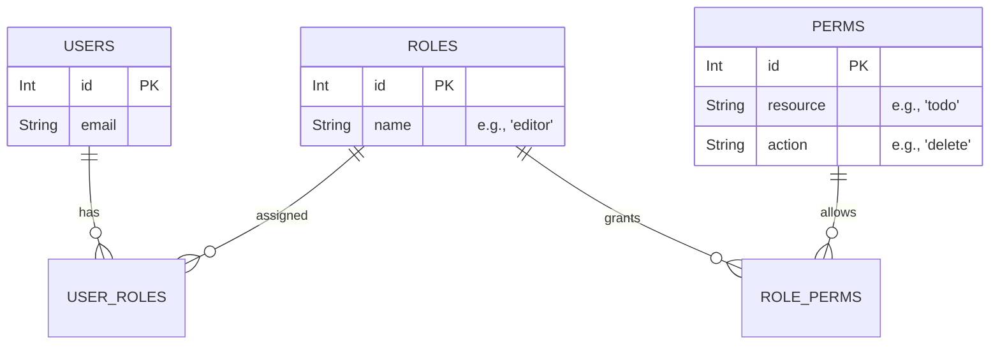

# Role-Based Access Control (RBAC) in FastAPI

Role-Based Access Control (RBAC) is a security paradigm where access to system resources is restricted based on the role assigned to individual users. 

In this project, RBAC is implemented in a very minimal, yet effective, way. We will explore how that looks, and then discuss how to scale this up to a robust, advanced RBAC system for enterprise applications.

---

## 1. Minimal RBAC (Current Implementation)

The current project distinguishes between regular users and `admin` users.

### How it Works
1. **The Model:** `models.py` defines a simple string column for roles: `role = Column(String)`. When a user registers via `/auth/`, they can pass `"admin"` or `"user"` into the JSON body.
2. **The Token:** Inside `auth.py`, when `create_access_token` generates the JWT, it explicitly embeds the user's role into the cryptographically signed payload:
   ```python
   encode = {'sub': username, 'id': userid, 'role': role}
   ```
3. **The Restriction:** Look at how the `/admin/todo` endpoint is protected inside `<project_root>/todoapp/routers/admin.py`:
   ```python
   @router.get('/todo', status_code=status.HTTP_200_OK)
   async def read_all(user: user_dependency, db: db_dependency):
       if user is None or user.get('user_role') != 'admin':
           raise HTTPException(status_code=401, detail='Authentication Failed!')
       return db.query(Todos).all()
   ```

### Why this is Minimal
- **Hardcoded:** The check `user.get('user_role') != 'admin'` is hardcoded inside the route itself. If you change a role name to `superadmin`, you must manually update every single route string.
- **Granular Permissions:** What if an `editor` can read, but not delete? This simple string comparison cannot handle complex "permissions" efficiently.

---

## 2. Advanced Multi-Role RBAC (The Future)

In a massive enterprise FastAPI application, you do not hardcode role strings. Instead, you build a "Permissions Matrix."

### Step 1: Normalize Your Database
Create distinct tables for Roles and Permissions, moving away from a simple string on the User model.



### Step 2: Custom Dependency Classes (The Enforcer)
Instead of checking string equality *inside* the route logic, you build a custom dependency class that intercepts the request *before* it even hits the route logic.

```python
class RoleChecker:
    def __init__(self, allowed_roles: list):
        self.allowed_roles = allowed_roles

    def __call__(self, user: Annotated[dict, Depends(get_current_user)]):
        if user.get("role") not in self.allowed_roles:
            raise HTTPException(status_code=403, detail="Not Enough Permissions")
        return user
```

### Step 3: Protecting the Routes Cleanly
Now, instead of cluttering your business logic with simple string conditionals, you just pass your `RoleChecker` directly into the `Depends()` block of the FastAPI route decorator!

```python
allow_create = RoleChecker(["admin", "manager", "writer"])

@router.post('/todo', dependencies=[Depends(allow_create)])
async def create_todo(todo_request: TodoRequest, db: db_dependency):
    # If the user reaches here, we are 100% certain they have the 
    # required role. We don't even need the 'user' dict physically 
    # passed to this function if we don't need their ID!
    
    # ... logic to save Todo
    db.add(new_todo)
    db.commit()
```

### Why this is Advanced
1. **DRY (Don't Repeat Yourself):** You define `RoleChecker(["editor", "admin"])` once, and attach it to 50 endpoints instantly. 
2. **Database Driven:** In truly massive apps, the `RoleChecker` queries the Postgres `PERMISSIONS` table (cached in Redis) to see what a role is actively allowed to do, rather than hardcoding a list of strings.
3. **Clean Controller:** The actual route (`create_todo`) contains *only* business logic, making it easier to read and test.
