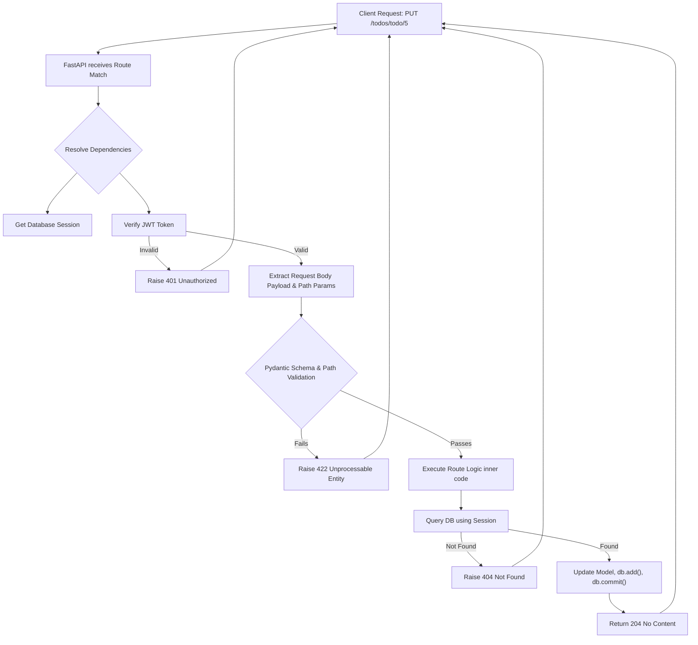

# Routers and Endpoints Explained

In FastAPI, the `main.py` file can get messy very quickly if you define all your API endpoints (routes) in one place. To solve this, FastAPI provides `APIRouter`, which allows you to split your application into smaller, cohesive modules.

In this project, these modules are stored in the `routers/` directory:
- `auth.py`: Handles login and user creation.
- `todos.py`: Handles CRUD (Create, Read, Update, Delete) operations for Todo items.
- `users.py`: Handles user-specific actions (like changing a password).
- `admin.py`: Handles system-wide actions restricted to administrators.

---

## Anatomy of a Typical Endpoint

Let's look at a typical endpoint from `todos.py` that demonstrates dependency injection, path parameters, and database interactions:

```python
@router.put('/todo/{todo_id}', status_code=status.HTTP_204_NO_CONTENT)
async def update_todo(user: user_dependency, db: db_dependency,
                      todo_request: TodoRequest,
                      todo_id: int = Path(gt=0)):
    if user is None:
        raise HTTPException(status_code=401, detail='Authentication failed')

    todo_model = db.query(Todos).filter(Todos.id == todo_id).filter(
        Todos.owner_id == user.get('id')).first()
        
    if todo_model is None:
        raise HTTPException(status_code=404, detail='Todo not found')

    # Update logic ...
    db.add(todo_model)
    db.commit()
```

### 1. The Route Decorator
```python
@router.put('/todo/{todo_id}', status_code=status.HTTP_204_NO_CONTENT)
```
- `@router.put` defines the HTTP method (PUT is for updating data).
- `'/todo/{todo_id}'` defines the URL path. The curly braces `{}` imply a dynamic path parameter.
- `status_code` explicitly sets the HTTP response code (204 means the request was successful, but there is no content to return).

### 2. Path Parameters and Validation
```python
todo_id: int = Path(gt=0)
```
- FastAPI automatically extracts `{todo_id}` from the URL as a string.
- By defining `todo_id: int`, FastAPI enforces that the URL segment *must* be convertible to an integer (e.g., `/todo/5` works, `/todo/abc` returns an automated 422 Validation Error).
- `Path(gt=0)` enforces even stricter rules: the integer must be **g**reater **t**han zero.

### 3. Query Parameters
While not heavily explicitly used in this specific project's subset, a query parameter is simply a function argument that is *not* part of the path structure.
For example, if the function looked like this:
```python
async def read_all(user: user_dependency, db: db_dependency, limit: int = 10):
```
The URL would look like `/todos?limit=5`. FastAPI automatically parses the `?limit=5` part of the URL because `limit` is not defined in the `@router.get(...)` path string.

### 4. Dependency Injection
```python
async def update_todo(user: user_dependency, db: db_dependency, ...):
```
These arguments don't come from the user's JSON payload or the URL. They come from FastAPI executing custom helper functions before the route runs:
- `db_dependency` pauses the route, fetches an active Postgres session from the connection pool, and injects it as the `db` variable.
- `user_dependency` intercepts the incoming request's HTTP Headers, finds the `Bearer` token, decodes the JWT, and injects the user dictionary (id, username, role) as the `user` variable.

### 5. The Application Logic
```python
todo_model = db.query(Todos).filter(Todos.id == todo_id).filter(Todos.owner_id == user.get('id')).first()
```
This single line uses SQLAlchemy to query the database. It combines both the dynamic URL `todo_id` and the verified JWT payload `user.get('id')` to ensure a user can *only* retrieve a Todo item that they actually own.

---

## Endpoint Lifecycle Flowchart


